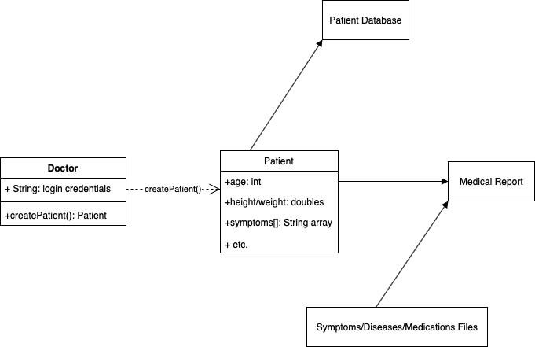

# HealthTrack- Medical Report System in Java

## Project Abstract
This system will allow doctors to input data on individual patients including their age, height/weight, blood pressure, symptoms, etc. Based on this data, the system will create a tenative report on the patient detailing their current medical status and a list of viruses/diseases that the patient most likely may have. In addition, the system will also generate a list of reccomended medications to prescribe based on the patients medical status. As the doctor inputs patients, they will be added to a database where they can be accessed at any time and be easily put back into the system if their information changes.

## Project Relevance
This project is relevant to our educational goals as it implements object-oriented design, test driven development, and access to a database. Both the doctor and patients will be designed as objects within the system, tests will be run to determine the correctness of the medical reports based on the inputs, and JDBC will be implemented to store the patients and all of their information.

## Conceptual Design
This project is one that wil be made from scratch. The design process can be broken down into pieces concerning different parts of the system. The first part is creating classes for both doctors and patients. For doctors, this class would include login information in order to access the system as well as a method for creating an instance of a patient. For patients, the class will include attributes for all of the data that the doctor will input as well as their list of symptoms. After the information is entered, it will be compared to a file/database containing lists of symptoms and the diseases and medications most associated with them. We will need to design an algorithm to calcuate probabilities of diseases based on given information. Another algorithm will calculate the best medication to prescribe and at what dosage (this could depend on patients age or weight). This process will require lots of testing which can all be done using JUnit. Lastly, we will need to create and manage a database to store patient information. Once entered, patients will be given a unique ID number that the doctors can use to quickly access them and edit their information if needed.

## Required Resources
Group members should have experience in object oriented programming in Java, creating and executing junit tests, and with the JDBC (java database connectivity) API for Java.
